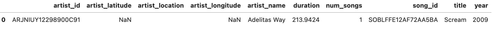
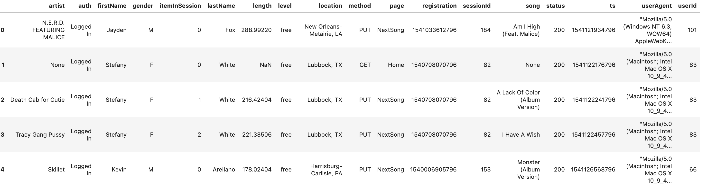
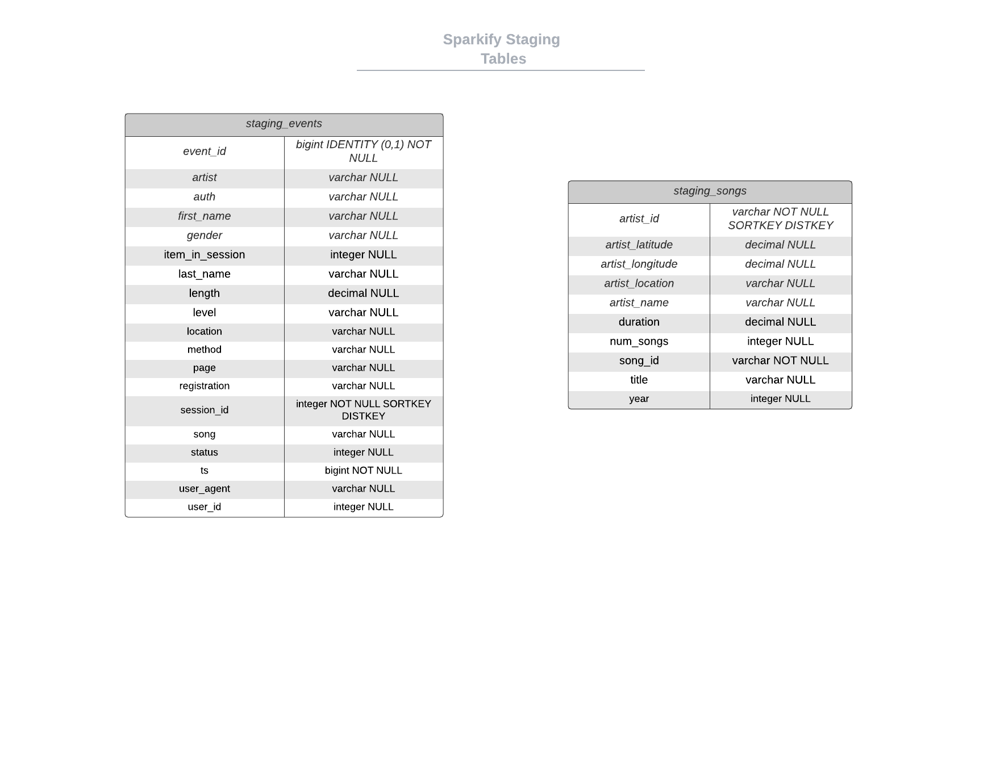
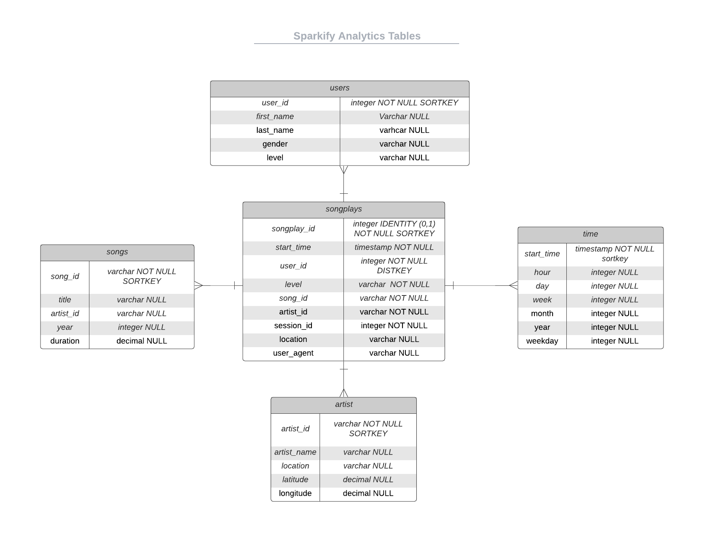

>>>>>  gd2md-html alert:  ERRORs: 0; WARNINGs: 0; ALERTS: 4.

<ul style="color: red; font-weight: bold"><li>See top comment block for details on ERRORs and WARNINGs. <li>In the converted Markdown or HTML, search for inline alerts that start with >>>>>  gd2md-html alert:  for specific instances that need correction.</ul>

Links to alert messages:
<a href="#gdcalert1">alert1</a>
<a href="#gdcalert2">alert2</a>
<a href="#gdcalert3">alert3</a>
<a href="#gdcalert4">alert4</a>

>>>>> PLEASE check and correct alert issues and delete this message and the inline alerts.

**Project Three: Data Warehouse**

 

**Overview**

This project builds an ETL pipeline on AWS Cloud for a music streaming service called Sparkify by extracting data from JSON files in S3, staging the data in Redshift, and transforming the data into a set of dimensional tables. This allows the Sparkify analytics team to analyze the song and user data to answer questions like “What day of the week are users listening the most?”

**Technologies used**

*   SQL -
    *   Used for dropping, creating, inserting, copying JSON files, and running test queries 
*   Python 
    *   Boto3 - Amazon SDK
        *   Used to create IAM Role, Redshift Cluster, and run SQL Queries 
*   Redshift
    *   Data Warehouse used to Stage data from S3 and create dimension tables for analytics team
*   S3 
    *   Storage service that holds event and song data JSON files

**How to Run **

*   AWS
    *   Creating_Warehouse.ipynb
        *   Used to Create IAM Role, Redshift Cluster
    *   Create an IAM user 
        *   With permissions to use Redshift
    *   Create IAM role for Redshift with AmazonS3ReadOnlyAccess rights
        *   Need the ARN
    *   Create the Redshift cluster
        *   Get the Endpoint ---- also known as Host
*   Fill in the dwh.cfg with your info
    *   Key, Secret, Host, ARN, etc
*   Run create_tables.py
    *   Drops and Creates Tables
*   Run etl.py
    *   Copies and Inserts data into tables
*   Test_queries.ipynb
    *   Jupyter Notebook used to run test queries

**Information About Dataset**

*   s3://udacity-dend/song_data
    *   31 JSON files
*   **Song_Data Example**

*   s3://udacity-dend/log_data
    *   14897 JSON files
*   **Log_Data Example**

*   Staging_events_table
    *   8056 rows
*   Staging_songs_table
    *   14896 rows
*   User_table
    *   104 Unique Users
*   Song_table
    *   14896 Unique Songs
*   Artist_table
    *   10025 Unique Artist
*   Songplay table
    *   9957 song plays

**Queries Examples from Test_Queries.ipynb**

1. Give me the artist, song title and song's length of the top 15 songs by duration.

*   **Query:** 

    		     select a.artist_name, s.title, s.duration 
		     
		     From artist a

                      JOIN song s on (a.artist_id = s.artist_id)

                      ORDER BY s.duration DESC limit 15;

*   **Query Result Example First Row:** Jean Grae, Chapter One: Destiny, 2709
*   **Query:**

		Select t.weekday, count(s.songplay_id) as number_of_listens_each_day
	
		From time t
	
		JOIN songplay s  on (t.start_time = s.start_time)

		Group by t.weekday
	
		Order by number_of_listens_each_day DESC;

*   **Query Result Example First Row:** 5, 1966
    *   Most listens are on Saturday

	

**Database Info and Tables**

